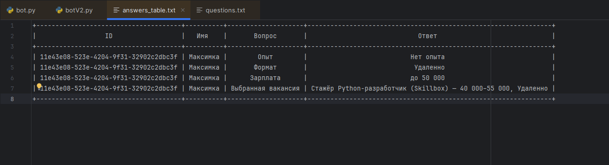

> [!CAUTION]
> Мне пофик, Мавр сделал своё дело, Мавр может уходить, а с вас миллионы тысяч деняг 💵💵💵

> [!TIP]
> Связь через менеджера
> Анастасия Домовёнок - @nass_ey


Короче код в питон вставлять, пип инсталы нажимать, мне их писать лень, гуглить пошел давай. Если на импорты ругаются, импорты не запускаются - иди гугл спрашивай, какой pip install нажимать и куда.
Вопросы мне можно задавать, я на них совсем не отвечать..

Парсить с хедъантера мне тоже лень, чисто для отчета преподу хватит.

Тег бота в тг: @ProjectQuestionsBot  
ну или ссылка: https://t.me/ProjectQuestionsBot

А вот как сохраняются ответы пользователей ( отдельным файлом если что, базу данных в падлу делать ыыы):




Код короче вот:

==================================================================================
```

import telebot
from telebot import types
import csv
import uuid
import os
from prettytable import PrettyTable  

TOKEN = "OUR_TOKEN"   #Его тут нет ибо мало ли кто в бота залезет
bot = telebot.TeleBot(TOKEN)

user_data = {}

# создаем CSV-файл, если его нет
if not os.path.exists("answers.csv"):
    with open("answers.csv", "w", encoding="utf-8", newline="") as f:
        writer = csv.writer(f)
        writer.writerow(["user_id", "Имя", "Вопрос", "Ответ"])

# --- БАЗА ВАКАНСИЙ ---
VACANCIES = {
    "IT": [
        {"title": "Стажёр Python-разработчик", "company": "Skillbox", "salary": "40 000–55 000", "format": "Удаленно",
         "exp": "Нет опыта", "description": "Помощь в разработке учебных сервисов.", "contact": "hr@skillbox.ru"},
        {"title": "Junior Frontend-разработчик", "company": "Т-Банк", "salary": "60 000–80 000", "format": "В офисе",
         "exp": "До 1 года", "description": "Разработка веб-интерфейсов.", "contact": "jobs@tbank.ru"},
        {"title": "Middle Python-разработчик", "company": "Яндекс", "salary": "120 000–150 000", "format": "Удаленно",
         "exp": "1–3 года", "description": "Разработка API и микросервисов.", "contact": "dev@yandex.ru"},
        {"title": "Senior DevOps-инженер", "company": "VK", "salary": "200 000+", "format": "В офисе",
         "exp": "Более 3 лет", "description": "Поддержка CI/CD, серверной инфраструктуры.", "contact": "devops@vk.com"},
    ],

    "Маркетинг": [
        {"title": "Ассистент маркетолога", "company": "Skyeng", "salary": "45 000–55 000", "format": "Удаленно",
         "exp": "Нет опыта", "description": "Помощь в запуске рекламных кампаний.", "contact": "hr@skyeng.ru"},
        {"title": "Контент-менеджер", "company": "Ozon", "salary": "70 000–90 000", "format": "В офисе",
         "exp": "До 1 года", "description": "Создание и размещение контента.", "contact": "jobs@ozon.ru"},
        {"title": "SMM-специалист", "company": "Яндекс", "salary": "110 000–130 000", "format": "Удаленно",
         "exp": "1–3 года", "description": "Продвижение проектов в соцсетях.", "contact": "smm@yandex.ru"},
        {"title": "Маркетолог-аналитик", "company": "Avito", "salary": "180 000+", "format": "В офисе",
         "exp": "Более 3 лет", "description": "Анализ метрик и стратегия роста.", "contact": "career@avito.ru"},
    ],

    "Продажи": [
        {"title": "Менеджер по продажам", "company": "SkyPro", "salary": "50 000–70 000", "format": "Удаленно",
         "exp": "Нет опыта", "description": "Работа с клиентами онлайн.", "contact": "sales@skypro.com"},
        {"title": "Оператор колл-центра", "company": "Wildberries", "salary": "60 000–80 000", "format": "В офисе",
         "exp": "До 1 года", "description": "Общение с клиентами и оформление заказов.", "contact": "call@wb.ru"},
        {"title": "Менеджер B2B", "company": "Ozon", "salary": "100 000–130 000", "format": "В офисе",
         "exp": "1–3 года", "description": "Продажа услуг корпоративным клиентам.", "contact": "corp@ozon.ru"},
        {"title": "Руководитель отдела продаж", "company": "VK", "salary": "200 000+", "format": "В офисе",
         "exp": "Более 3 лет", "description": "Управление командой и развитие продаж.", "contact": "sales@vk.com"},
    ],

    "Дизайн": [
        {"title": "Junior UI-дизайнер", "company": "Skillbox", "salary": "45 000–60 000", "format": "Удаленно",
         "exp": "Нет опыта", "description": "Создание макетов под наставничеством.", "contact": "design@skillbox.ru"},
        {"title": "Графический дизайнер", "company": "Яндекс", "salary": "80 000–100 000", "format": "В офисе",
         "exp": "1–3 года", "description": "Создание брендовых визуалов.", "contact": "hr@yandex.ru"},
        {"title": "Арт-директор", "company": "S7 Airlines", "salary": "180 000+", "format": "В офисе",
         "exp": "Более 3 лет", "description": "Руководство дизайн-командой.", "contact": "career@s7.ru"},
    ]
}


# --- СТАРТ ---
@bot.message_handler(commands=['start'])
def start(message):
    bot.send_message(message.chat.id, "👋 Привет! Я помогу подобрать подходящую вакансию.\nКак тебя зовут?")
    user_data[message.chat.id] = {"id": str(uuid.uuid4()), "step": "name", "answers": {}}


@bot.message_handler(func=lambda m: m.chat.id in user_data)
def handle_message(message):
    user = user_data[message.chat.id]
    if user["step"] == "name":
        user["answers"]["Имя"] = message.text.strip()
        user["step"] = "sphere"
        ask_sphere(message.chat.id)


# --- Вопросы ---
def ask_sphere(chat_id):
    markup = types.InlineKeyboardMarkup()
    for s in VACANCIES.keys():
        markup.add(types.InlineKeyboardButton(s, callback_data=f"sphere_{s}"))
    bot.send_message(chat_id, "🔎 В какой сфере ты хочешь работать?", reply_markup=markup)


def ask_experience(chat_id, sphere):
    markup = types.InlineKeyboardMarkup()
    for e in ["Нет опыта", "До 1 года", "1–3 года", "Более 3 лет"]:
        markup.add(types.InlineKeyboardButton(e, callback_data=f"exp_{e}"))
    bot.send_message(chat_id, f"📊 Отлично! Какой у тебя опыт в сфере {sphere}?", reply_markup=markup)


def ask_format(chat_id):
    markup = types.InlineKeyboardMarkup()
    for f in ["Удаленно", "В офисе"]:
        markup.add(types.InlineKeyboardButton(f, callback_data=f"format_{f}"))
    bot.send_message(chat_id, "🏢 В каком формате тебе удобнее работать?", reply_markup=markup)


def ask_salary(chat_id):
    markup = types.InlineKeyboardMarkup()
    for s in ["до 50 000", "50 000–100 000", "100 000–150 000", "от 150 000"]:
        markup.add(types.InlineKeyboardButton(s, callback_data=f"salary_{s}"))
    bot.send_message(chat_id, "💰 Какой уровень зарплаты ты рассматриваешь?", reply_markup=markup)


# --- CALLBACK ---
@bot.callback_query_handler(func=lambda call: True)
def handle_callback(call):
    chat_id = call.message.chat.id
    user = user_data.get(chat_id)
    if not user:
        return
    data = call.data
    bot.answer_callback_query(call.id)

    if data.startswith("sphere_"):
        sphere = data.split("_", 1)[1]
        user["answers"]["Сфера"] = sphere
        save_answer(user, "Сфера", sphere)
        ask_experience(chat_id, sphere)
        return

    if data.startswith("exp_"):
        exp = data.split("_", 1)[1]
        user["answers"]["Опыт"] = exp
        save_answer(user, "Опыт", exp)
        ask_format(chat_id)
        return

    if data.startswith("format_"):
        form = data.split("_", 1)[1]
        user["answers"]["Формат"] = form
        save_answer(user, "Формат", form)
        ask_salary(chat_id)
        return

    if data.startswith("salary_"):
        salary = data.split("_", 1)[1]
        user["answers"]["Зарплата"] = salary
        save_answer(user, "Зарплата", salary)
        show_vacancies(chat_id)
        return

    if data.startswith("vac_"):
        vac_id = int(data.split("_", 1)[1])
        show_vacancy_details(chat_id, vac_id)
        return


# --- Показ вакансий ---
def show_vacancies(chat_id):
    user = user_data[chat_id]
    answers = user["answers"]
    sphere, exp, form, salary = answers["Сфера"], answers["Опыт"], answers["Формат"], answers["Зарплата"]

    all_vacs = VACANCIES.get(sphere, [])
    filtered = [v for v in all_vacs if v["exp"] == exp and v["format"] == form]

    def match_salary(vac_salary, desired):
        vac_min = int(vac_salary.split("–")[0].replace(" ", "").replace("+", ""))
        if "до" in desired and vac_min <= 50000:
            return True
        if "50" in desired and "100" in desired and 50000 <= vac_min <= 100000:
            return True
        if "100" in desired and "150" in desired and 100000 <= vac_min <= 150000:
            return True
        if "150" in desired and vac_min >= 150000:
            return True
        return False

    filtered = [v for v in filtered if match_salary(v["salary"], salary)]

    if not filtered:
        filtered = all_vacs

    bot.send_message(chat_id, "🎯 По твоим ответам я нашёл следующие вакансии:")

    markup = types.InlineKeyboardMarkup()
    for i, v in enumerate(filtered, 1):
        markup.add(types.InlineKeyboardButton(
            f"{v['title']} ({v['company']}) — {v['salary']}, {v['format']}",
            callback_data=f"vac_{i}"
        ))

    user["vacancies"] = filtered
    bot.send_message(chat_id, "👇 Выбери, чтобы узнать подробнее:", reply_markup=markup)


def show_vacancy_details(chat_id, vac_id):
    vac = user_data[chat_id]["vacancies"][vac_id - 1]

    # Сохраняем выбранную вакансию в ответы
    user = user_data[chat_id]
    save_answer(user, "Выбранная вакансия", f"{vac['title']} ({vac['company']}) — {vac['salary']}, {vac['format']}")

    # Отправляем детали пользователю
    bot.send_message(chat_id, f"""
📋 {vac['title']}
🏢 Компания: {vac['company']}
💰 Зарплата: {vac['salary']}
📍 Формат: {vac['format']}
🕒 Опыт: {vac['exp']}
🧭 {vac['description']}
✉️ Контакт: {vac['contact']}
""")


# --- Сохранение и таблица ---
def save_answer(user, question, answer):
    # сохраняем в CSV
    with open("answers.csv", "a", encoding="utf-8", newline="") as f:
        writer = csv.writer(f)
        writer.writerow([user["id"], user["answers"].get("Имя", ""), question, answer])
    # обновляем таблицу
    update_table_file()


def update_table_file():
    """Создаёт красивую таблицу answers_table.txt"""
    table = PrettyTable(["ID", "Имя", "Вопрос", "Ответ"])

      открываем CSV с правильной обработкой кавычек 
    with open("answers.csv", "r", encoding="utf-8", newline="") as f:
        reader = csv.reader(f)
        next(reader, None)  # пропускаем заголовок
        for row in reader:
            if len(row) >= 4:  # берём только первые 4 значения
                table.add_row(row[:4])

    with open("answers_table.txt", "w", encoding="utf-8") as f:
        f.write(str(table))


print("🤖 Бот запущен! Таблица ответов создаётся автоматически.")
bot.polling(none_stop=True)


```
